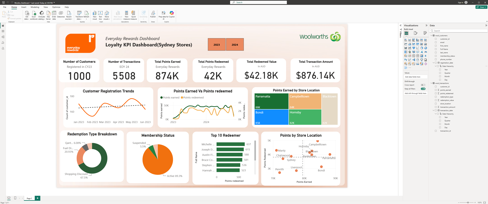
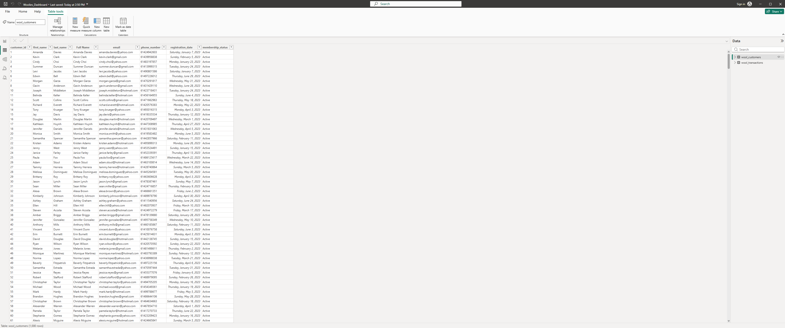
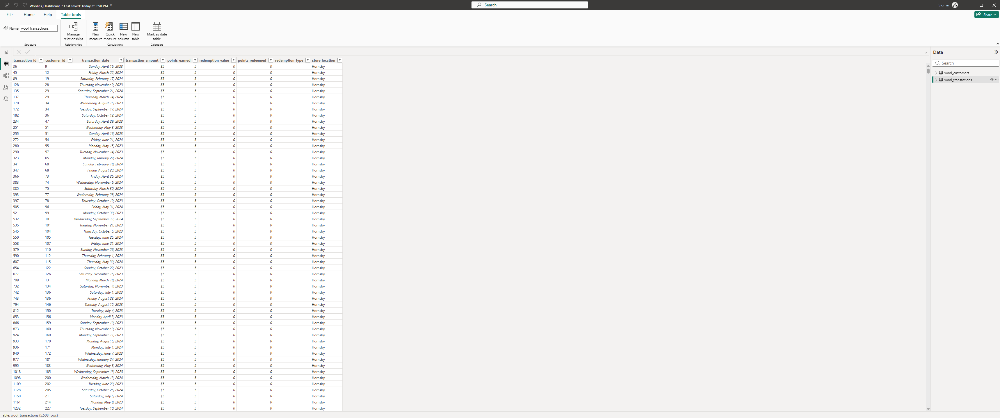
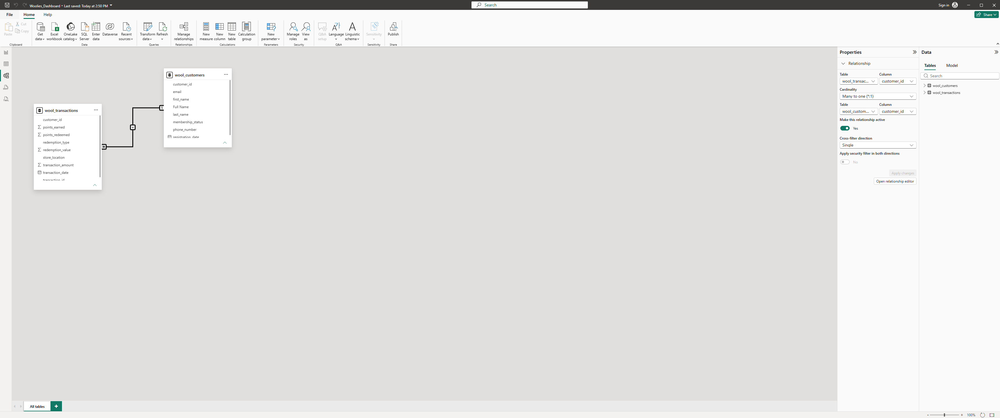

# Woolworths Everyday Rewards Loyalty KPI Dashboard (Power BI)


A single-page Power BI dashboard analysing loyalty programme performance across 11 Sydney stores. It uses a Woolworths Everyday Rewards–style dataset of **1,000 members** and **5,508 transactions** from January 2023 to November 2024.



---

## Table of Contents

- [Overview](#overview)
- [Business Questions](#business-questions)
- [Dataset](#dataset)
- [Approach](#approach)
- [Data Model](#data-model)
- [Headline KPIs](#headline-kpis)
- [Key Insights](#key-insights)
- [Recommendations](#recommendations)
- [Limitations and Next Steps](#limitations-and-next-steps)
- [Repository Structure](#repository-structure)
- [How to Use](#how-to-use)
- [Author](#author)

---

## Overview

I built this dashboard during my data analytics training at The Data Analytics Institute. The brief was to turn raw customer and transaction records into a KPI view that a loyalty or store operations team could use to monitor programme performance across Sydney stores.

> **Note on the data:** This is a Woolworths Everyday Rewards–*style* training dataset. It is not official Woolworths Group data, and all customer details are fictional.

## Business Questions

1. How many members are enrolled, and how active are they?
2. How much are members spending, and how many points are they earning and redeeming?
3. Which stores drive the most points activity, and where is redemption engagement strongest or weakest?
4. How do members prefer to use their points?

## Dataset

| Table | Rows | Key fields |
|---|---|---|
| `wool_customers` | 1,000 | `customer_id`, `registration_date`, `membership_status` |
| `wool_transactions` | 5,508 | `transaction_id`, `customer_id`, `transaction_date`, `transaction_amount`, `points_earned`, `points_redeemed`, `redemption_value`, `redemption_type`, `store_location` |

- **Stores:** Bankstown, Blacktown, Bondi, Campbelltown, Chatswood, Hornsby, Liverpool, Manly, Parramatta, Penrith, Sydney
- **Transaction period:** 5 January 2023 to 8 November 2024
- **Registration period:** 1 January 2023 to 30 June 2023

### Data preview

**Customers table**



**Transactions table**



## Approach

| Phase | Work completed |
|---|---|
| **1. Data validation** | Checked for duplicate and orphan IDs, missing values, redemption fields that did not match each other, and transactions dated before registration. None were found. All dashboard KPIs reconcile exactly to the source data. |
| **2. Data modelling** | Loaded both tables through Power Query and related them on `customer_id`. |
| **3. KPI design** | Defined six headline KPIs covering membership, activity, points and value. |
| **4. Dashboard build** | Designed a single-page report with year selectors, trend visuals, store comparisons, redemption and membership breakdowns, and a Top 10 redeemer ranking. |

## Data Model



- **Relationship:** `wool_customers` (one) to `wool_transactions` (many), on `customer_id`
- **Cross-filter direction:** Single, so customer attributes such as membership status filter transaction measures

## Headline KPIs

| KPI | Value |
|---|---|
| Registered customers | 1,000 |
| Transactions | 5,508 |
| Total transaction amount | $876.14K |
| Points earned | 874K |
| Points redeemed | 42K |
| Redeemed value | $42.18K |

## Key Insights

1. **Low redemption engagement.** Only **4.8%** of earned points have been redeemed, and just **38%** of members have ever redeemed.
2. **Store redemption varies more than spend.** Store spend is tightly clustered ($71K to $88K), but redemption rates range from **6.0% (Manly)** to **3.7% (Bondi and Liverpool)**. Bondi ranks second for spend but among the lowest for redemption.
3. **Shopping discounts dominate.** Shopping Discount takes **67.5%** of points redeemed, followed by Fuel Discount (20.9%), Qantas Points (6.1%) and Donation (5.5%).
4. **Lapsed members still spend.** Inactive and suspended members are **10.7%** of the base but generated **11.4%** of spend ($99.8K).
5. **Spend is broad-based.** The top 10% of customers contribute only **23.9%** of total spend.
6. **Trading is steady, not growing.** Quarterly spend held flat at **$130K to $142K** from Q3 2023 to Q3 2024.

### Redemption rate by store

| Store | Points earned | Points redeemed | Redemption rate |
|---|---:|---:|---:|
| Manly | 71,113 | 4,298 | 6.0% |
| Campbelltown | 84,285 | 4,974 | 5.9% |
| Hornsby | 82,475 | 4,252 | 5.2% |
| Sydney | 75,840 | 3,870 | 5.1% |
| Bankstown | 81,728 | 4,142 | 5.1% |
| Chatswood | 73,194 | 3,701 | 5.1% |
| Blacktown | 82,421 | 3,987 | 4.8% |
| Parramatta | 88,215 | 4,007 | 4.5% |
| Penrith | 72,116 | 2,708 | 3.8% |
| Liverpool | 77,485 | 2,849 | 3.7% |
| Bondi | 85,495 | 3,128 | 3.7% |

## Recommendations

- Run targeted redemption campaigns in high-spend, low-redemption stores (Bondi, Liverpool, Penrith).
- Promote non-grocery redemption options to lift overall redemption rates.
- Target inactive and suspended members with reactivation offers, since they are still transacting.

## Limitations and Next Steps

- **Partial periods.** Both 2023 and 2024 are incomplete, so the early and late movements in trend charts reflect partial months.
- **Short registration window.** All members registered in the first half of 2023, so registration trends cover six months only.
- **Planned improvements:**
  - Add a dedicated date table for consistent time intelligence.
  - Add a redemption-rate-by-store visual.
  - Key the Top 10 ranking on `customer_id`, since some customer names are duplicated.
  - Add member-level segmentation.

## Repository Structure

```
woolworths_everyday_rewards_dashboard/
├── README.md
├── Woolies_Dashboard.pbix            # Power BI report file
├── woolworths_rewards_dataset.xlsx   # Source dataset (customers and transactions)
├── dashboard-overview.png            # Report page screenshot
├── data-model.png                    # Model view screenshot
├── customers-table.png               # Customers table preview
└── transactions-table.png            # Transactions table preview
```

## How to Use

1. Clone or download this repository.
2. Open `Woolies_Dashboard.pbix` in [Power BI Desktop](https://powerbi.microsoft.com/desktop/).
3. If prompted, point the data source to `woolworths_rewards_dataset.xlsx` and refresh.
4. Use the **2023** and **2024** buttons to filter the report by year.

## Author

**Joseph Clifford Kamau Muiruri**
Financial Data Analyst | Master of Financial Analysis (FinTech)

- Portfolio: [datascienceportfol.io/cliffjoem](https://www.datascienceportfol.io/cliffjoem)
- LinkedIn: *add your LinkedIn URL*
